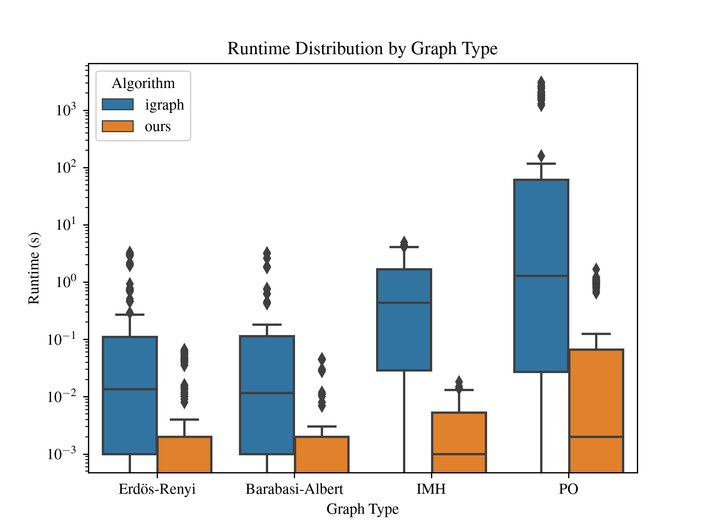

# is_perfect

This program, `is_perfect`, is used to recognize whether a graph is [perfect](https://en.wikipedia.org/wiki/Perfect_graph) or not. It is based on Strong Perfect Graph Theorem which states that a graph $G$ is perfect if and only if no induced subgraph of $G$ is an odd cycle of length at least 5 (odd hole) or the complement of such cycle (odd antihole) [[1]](https://doi.org/10.4007/annals.2006.164.51).

The only (as far as I know) other alternative program that is ready to use for recognizing perfect graphs is the [`is_perfect`](https://igraph.org/c/html/0.10.16/igraph-Coloring.html#igraph_is_perfect) function of [`igraph`, a C library](https://igraph.org/c/). Our program is approximately 1000 times faster than its counterpart in `igraph` library. Related results can be found below in [Section "Comparison with `igraph` library"](#comparison-with-igraph-library).

Additionally, this program can be used to enumerate and list all odd holes and odd antiholes in a graph, if needed.

## Usage

### 1. Downloading the program

Download or clone this repository to your machine. You may download directly from Github webpage: Code > Code > Download ZIP. Then extract the archived file. Or, you may clone the repository using git.

```
git clone https://github.com/buraknurerdem/is-perfect
```

### 2. Compiling the code

Open a terminal and navigate to the program folder. Then, compile the program with a C++ compiler. We use [`clang++`](https://clang.llvm.org/), and the compilation command is as follows.

**macOS / Linux:**
```bash
clang++ -std=c++20 -O3 -Iinclude -o is_perfect src/*.cpp
```
**Windows:**
```
clang++ -std=c++20 -O3 -Iinclude -o is_perfect src\*.cpp
```

### 3. About the input format

Inputs should be an adjacency matrix of a graph. Extensions `.csv` and `.txt` are supported. The vertices may be seperated by commas, spaces or any other character besides `0` and `1`. For example, `sample_inputs/graph1.csv` has the following content.

```
0,1,0,0,1
1,0,1,0,0
0,1,0,1,0
0,0,1,0,1
1,0,0,1,0
```

Also, in `.txt` files vertices can be placed consecutively, without a seperator. Such example is `sample_inputs/graph2.txt` which has the following content.

```
0110000000
1001100111
1000000000
0100011000
0100000000
0001000000
0001000000
0100000000
0100000000
0100000000
```

This program is designed to work with simple graph which has no loops, multiple edges nor directed edges. Therefore, the adjacency matrix is expected to be consist of ones and zeros and be symmetric. Otherwise, the behavior is undefined.

If your graphs are held in a different manner, you may modify the source code before compiling. The function that you need to alter is named `read_graph_adj_matrix_from_file` which is defined in `src/utils.cpp`.

### 4. Using the program

After a successful compilation, an executable file named `is_perfect` should be ready to use in the folder. You may execute the program as `is_perfect.exe ...` in Windows and as `./is_perfect ...` in macOS/Linux. For the remainder of the document, example commands are intended for macOS and Linux users.

The program is designed to work with a single graph as well as a folder of graphs. Single file use can be carried out by the `-i` flag. An example command:

```
./is_perfect -i sample_inputs/graph2.txt
```

The output will be printed on the console.

```
Running is_perfect for file: sample_inputs/graph2.txt

Perfect: sample_inputs/graph2.txt

Total Runtime: 0 seconds
```

The program can be ran for a folder of graphs using flag `-f`:

```
./is_perfect -f sample_inputs
```

If no additional flags are specified, the total number of perfect and non-perfect graphs will be displayed when the program finishes. If wished, the program will display the file names of perfect graphs when flag `-p` is activated. Likewise, the file names of non-perfect graphs are displayed when flag `-n` is used. In the following example, both flags are activated.
```
./is_perfect -f sample_inputs -n -p
```
Console Output:
```
Running is_perfect for folder: sample_inputs

Non-perfect: sample_inputs/graph1.csv
Perfect: sample_inputs/graph2.txt

Number of perfect graphs               1
Number of non-perfect graphs           1

Total Runtime: 0 seconds
```

### Enumerating all odd holes and antiholes

This program can also be used to enumerate odd holes and antiholes in a graph. This is achieved by activated the `-o` flag.

```
./is_perfect -i sample_inputs/graph3.txt -o
```
Console output:
```
Running is_perfect for file: sample_inputs/graph3.txt

Non-perfect: sample_inputs/graph3.txt
Number of odd holes: 1
Printing odd antiholes:
1, 6, 4, 8, 9, 
Number of odd antiholes: 0


Total Runtime: 0 seconds
```
In this way, you can find the odd holes and odd antiholes in a graph. Note that the indices start with 0. In the example above, vertices `1, 6, 4, 8, 9` induce a $C_5$, where the vertices are ordered along the cycle.

## Comparison with `igraph` library

We carried out a small experiment to compare the runtime performances of our `is_perfect` and `igraph`'s `is_perfect`, which is displayed in the table below. For each row, there are 10 different graphs, thus observations. Each entry in the table represents the average runtime in terms of seconds.

When the graph has abundant odd holes and odd antiholes, it is easy to infer that the graph is not perfect. However, when the graph is perfect, the algorithms take longer to conclude since they need to ensure that there are no odd holes or odd antiholes in the graph.

For the graphs that are not perfect, we randomly generated [Erdös-Renyi](https://en.wikipedia.org/wiki/Erd%C5%91s%E2%80%93R%C3%A9nyi_model) and [Barabasi-Albert](https://en.wikipedia.org/wiki/Barab%C3%A1si%E2%80%93Albert_model) graphs. For generating the perfect graphs, we used the `IterativeModificationHeuristic` (IMH) described in [[2]](https://arxiv.org/abs/2507.21987) and some operations which is used to obtain perfect graphs (PO) explained in [[3]](https://doi.org/10.1016/j.ejor.2020.09.017).

<table style="width:80%; font-size:12px" border="1" class="dataframe">
  <thead>
    <tr>
      <th colspan="2" rowspan="2">Graph Type:</th>
      <th colspan="4" style="text-align:center;">Non-perfect</th>
      <th colspan="4" style="text-align:center;">Perfect</th>
    </tr>
    <tr>
      <th colspan="2" style="text-align:center;">Erdös-Renyi</th>
      <th colspan="2" style="text-align:center;">Barabasi-Albert</th>
      <th colspan="2" style="text-align:center;">IMH</th>
      <th colspan="2" style="text-align:center;">PO</th>
    </tr>
    <tr>
      <th colspan="2">Runtime (seconds):</th>
      <th>igraph</th>
      <th>ours</th>
      <th>igraph</th>
      <th>ours</th>
      <th>igraph</th>
      <th>ours</th>
      <th>igraph</th>
      <th>ours</th>
    </tr>
    <tr>
      <th>Graph<br>Order</th>
      <th>Graph<br>Density</th>
      <th></th>
      <th></th>
      <th></th>
      <th></th>
      <th></th>
      <th></th>
      <th></th>
      <th></th>
    </tr>
  </thead>
  <tbody style="text-align:right;">
    <tr>
      <th rowspan="3" style="text-align:center;">10</th>
      <th style="text-align:center;">0.25</th>
      <td>0.0001</td>
      <td><0.0001</td>
      <td><0.0001</td>
      <td><0.0001</td>
      <td>0.0001</td>
      <td><0.0001</td>
      <td><0.0001</td>
      <td><0.0001</td>
    </tr>
    <tr>
      <th style="text-align:center;">0.50</th>
      <td>0.0002</td>
      <td><0.0001</td>
      <td>0.0006</td>
      <td><0.0001</td>
      <td>0.0008</td>
      <td><0.0001</td>
      <td>0.0005</td>
      <td><0.0001</td>
    </tr>
    <tr>
      <th style="text-align:center;">0.75</th>
      <td>0.0001</td>
      <td><0.0001</td>
      <td><0.0001</td>
      <td><0.0001</td>
      <td>0.0003</td>
      <td><0.0001</td>
      <td><0.0001</td>
      <td><0.0001</td>
    </tr>
    <tr>
      <th rowspan="3" style="text-align:center;">25</th>
      <th style="text-align:center;">0.25</th>
      <td><0.0001</td>
      <td><0.0001</td>
      <td><0.0001</td>
      <td><0.0001</td>
      <td>0.0477</td>
      <td><0.0001</td>
      <td>0.0246</td>
      <td><0.0001</td>
    </tr>
    <tr>
      <th style="text-align:center;">0.50</th>
      <td><0.0001</td>
      <td><0.0001</td>
      <td>0.0004</td>
      <td><0.0001</td>
      <td>0.0610</td>
      <td><0.0001</td>
      <td>0.0249</td>
      <td><0.0001</td>
    </tr>
    <tr>
      <th style="text-align:center;">0.75</th>
      <td><0.0001</td>
      <td><0.0001</td>
      <td><0.0001</td>
      <td><0.0001</td>
      <td>0.0523</td>
      <td><0.0001</td>
      <td>0.0232</td>
      <td><0.0001</td>
    </tr>
    <tr>
      <th rowspan="3" style="text-align:center;">50</th>
      <th style="text-align:center;">0.25</th>
      <td><0.0001</td>
      <td><0.0001</td>
      <td><0.0001</td>
      <td><0.0001</td>
      <td>0.8706</td>
      <td>0.0022</td>
      <td>0.2823</td>
      <td><0.0001</td>
    </tr>
    <tr>
      <th style="text-align:center;">0.50</th>
      <td><0.0001</td>
      <td><0.0001</td>
      <td><0.0001</td>
      <td><0.0001</td>
      <td>0.8775</td>
      <td>0.0031</td>
      <td>0.2828</td>
      <td><0.0001</td>
    </tr>
    <tr>
      <th style="text-align:center;">0.75</th>
      <td><0.0001</td>
      <td><0.0001</td>
      <td><0.0001</td>
      <td><0.0001</td>
      <td>0.8753</td>
      <td>0.0022</td>
      <td>0.2711</td>
      <td><0.0001</td>
    </tr>
    <tr>
      <th rowspan="3" style="text-align:center;">75</th>
      <th style="text-align:center;">0.25</th>
      <td>0.0010</td>
      <td><0.0001</td>
      <td>0.0010</td>
      <td><0.0001</td>
      <td>4.0924</td>
      <td>0.0119</td>
      <td>1.3297</td>
      <td>0.0019</td>
    </tr>
    <tr>
      <th style="text-align:center;">0.50</th>
      <td>0.0010</td>
      <td><0.0001</td>
      <td>0.0010</td>
      <td><0.0001</td>
      <td>4.2923</td>
      <td>0.0137</td>
      <td>1.2827</td>
      <td>0.0020</td>
    </tr>
    <tr>
      <th style="text-align:center;">0.75</th>
      <td>0.0010</td>
      <td><0.0001</td>
      <td>0.0010</td>
      <td><0.0001</td>
      <td>4.0702</td>
      <td>0.0115</td>
      <td>1.2006</td>
      <td>0.0016</td>
    </tr>
    <tr>
      <th rowspan="3" style="text-align:center;">100</th>
      <th style="text-align:center;">0.25</th>
      <td>0.0010</td>
      <td><0.0001</td>
      <td>0.0010</td>
      <td><0.0001</td>
      <td>---</td>
      <td>---</td>
      <td>3.8236</td>
      <td>0.0058</td>
    </tr>
    <tr>
      <th style="text-align:center;">0.50</th>
      <td>0.0020</td>
      <td><0.0001</td>
      <td>0.0018</td>
      <td><0.0001</td>
      <td>---</td>
      <td>---</td>
      <td>3.9841</td>
      <td>0.0060</td>
    </tr>
    <tr>
      <th style="text-align:center;">0.75</th>
      <td>0.0020</td>
      <td><0.0001</td>
      <td>0.0020</td>
      <td><0.0001</td>
      <td>---</td>
      <td>---</td>
      <td>3.2862</td>
      <td>0.0048</td>
    </tr>
    <tr>
      <th rowspan="3" style="text-align:center;">200</th>
      <th style="text-align:center;">0.25</th>
      <td>0.0050</td>
      <td><0.0001</td>
      <td>0.0049</td>
      <td><0.0001</td>
      <td>---</td>
      <td>---</td>
      <td>80.0230</td>
      <td>0.0771</td>
    </tr>
    <tr>
      <th style="text-align:center;">0.50</th>
      <td>0.0070</td>
      <td><0.0001</td>
      <td>0.0060</td>
      <td><0.0001</td>
      <td>---</td>
      <td>---</td>
      <td>77.1540</td>
      <td>0.0812</td>
    </tr>
    <tr>
      <th style="text-align:center;">0.75</th>
      <td>0.0074</td>
      <td><0.0001</td>
      <td>0.0070</td>
      <td><0.0001</td>
      <td>---</td>
      <td>---</td>
      <td>80.5587</td>
      <td>0.0719</td>
    </tr>
    <tr>
      <th rowspan="3" style="text-align:center;">400</th>
      <th style="text-align:center;">0.25</th>
      <td>0.0177</td>
      <td><0.0001</td>
      <td>0.0165</td>
      <td><0.0001</td>
      <td>---</td>
      <td>---</td>
      <td>2221.6404</td>
      <td>0.9554</td>
    </tr>
    <tr>
      <th style="text-align:center;">0.50</th>
      <td>0.0271</td>
      <td>0.0001</td>
      <td>0.0240</td>
      <td><0.0001</td>
      <td>---</td>
      <td>---</td>
      <td>1750.5521</td>
      <td>1.1339</td>
    </tr>
    <tr>
      <th style="text-align:center;">0.75</th>
      <td>0.0334</td>
      <td>0.0001</td>
      <td>0.0280</td>
      <td><0.0001</td>
      <td>---</td>
      <td>---</td>
      <td>1918.9583</td>
      <td>0.9165</td>
    </tr>
    <tr>
      <th rowspan="3" style="text-align:center;">600</th>
      <th style="text-align:center;">0.25</th>
      <td>0.0394</td>
      <td>0.0009</td>
      <td>0.0364</td>
      <td><0.0001</td>
      <td>---</td>
      <td>---</td>
      <td>---</td>
      <td>4.4626</td>
    </tr>
    <tr>
      <th style="text-align:center;">0.50</th>
      <td>0.0584</td>
      <td>0.0010</td>
      <td>0.0534</td>
      <td>0.0010</td>
      <td>---</td>
      <td>---</td>
      <td>---</td>
      <td>5.0601</td>
    </tr>
    <tr>
      <th style="text-align:center;">0.75</th>
      <td>0.0601</td>
      <td>0.0010</td>
      <td>0.0641</td>
      <td>0.0010</td>
      <td>---</td>
      <td>---</td>
      <td>---</td>
      <td>5.1201</td>
    </tr>
    <tr>
      <th rowspan="3" style="text-align:center;">800</th>
      <th style="text-align:center;">0.25</th>
      <td>0.0702</td>
      <td>0.0012</td>
      <td>0.0646</td>
      <td>0.0010</td>
      <td>---</td>
      <td>---</td>
      <td>---</td>
      <td>13.5552</td>
    </tr>
    <tr>
      <th style="text-align:center;">0.50</th>
      <td>0.1029</td>
      <td>0.0021</td>
      <td>0.0967</td>
      <td>0.0015</td>
      <td>---</td>
      <td>---</td>
      <td>---</td>
      <td>16.7824</td>
    </tr>
    <tr>
      <th style="text-align:center;">0.75</th>
      <td>0.1108</td>
      <td>0.0017</td>
      <td>0.1141</td>
      <td>0.0014</td>
      <td>---</td>
      <td>---</td>
      <td>---</td>
      <td>14.0135</td>
    </tr>
    <tr>
      <th rowspan="3" style="text-align:center;">1000</th>
      <th style="text-align:center;">0.25</th>
      <td>0.1118</td>
      <td>0.0025</td>
      <td>0.1008</td>
      <td>0.0020</td>
      <td>---</td>
      <td>---</td>
      <td>---</td>
      <td>34.6267</td>
    </tr>
    <tr>
      <th style="text-align:center;">0.50</th>
      <td>0.1967</td>
      <td>0.0033</td>
      <td>0.1488</td>
      <td>0.0025</td>
      <td>---</td>
      <td>---</td>
      <td>---</td>
      <td>38.9869</td>
    </tr>
    <tr>
      <th style="text-align:center;">0.75</th>
      <td>0.1750</td>
      <td>0.0027</td>
      <td>0.1794</td>
      <td>0.0020</td>
      <td>---</td>
      <td>---</td>
      <td>---</td>
      <td>34.7124</td>
    </tr>
    <tr>
      <th rowspan="3" style="text-align:center;">2000</th>
      <th style="text-align:center;">0.25</th>
      <td>0.4677</td>
      <td>0.0093</td>
      <td>0.4331</td>
      <td>0.0072</td>
      <td>---</td>
      <td>---</td>
      <td>---</td>
      <td>674.2246</td>
    </tr>
    <tr>
      <th style="text-align:center;">0.50</th>
      <td>0.7060</td>
      <td>0.0144</td>
      <td>0.6251</td>
      <td>0.0111</td>
      <td>---</td>
      <td>---</td>
      <td>---</td>
      <td>1247.6904</td>
    </tr>
    <tr>
      <th style="text-align:center;">0.75</th>
      <td>0.7619</td>
      <td>0.0119</td>
      <td>0.7563</td>
      <td>0.0109</td>
      <td>---</td>
      <td>---</td>
      <td>---</td>
      <td>695.5415</td>
    </tr>
    <tr>
      <th rowspan="3" style="text-align:center;">4000</th>
      <th style="text-align:center;">0.25</th>
      <td>2.0769</td>
      <td>0.0413</td>
      <td>1.8326</td>
      <td>0.0288</td>
      <td>---</td>
      <td>---</td>
      <td>---</td>
      <td>---</td>
    </tr>
    <tr>
      <th style="text-align:center;">0.50</th>
      <td>3.0537</td>
      <td>0.0585</td>
      <td>2.6164</td>
      <td>0.0449</td>
      <td>---</td>
      <td>---</td>
      <td>---</td>
      <td>---</td>
    </tr>
    <tr>
      <th style="text-align:center;">0.75</th>
      <td>3.0010</td>
      <td>0.0460</td>
      <td>3.1860</td>
      <td>0.0444</td>
      <td>---</td>
      <td>---</td>
      <td>---</td>
      <td>---</td>
    </tr>
  </tbody>
</table>

In the figure below, the runtimes are displayed in a box plot. As a note, the PO instances where we do not have results for `igraph` library are not included in the data for figure.




## References

1.  [Chudnovsky, M. , Robertson, N., Seymour P. and Thomas R., "The Strong Perfect Graph Theorem", *Annals of Mathematics*, Vol. 164, No. 1, pp. 51-229, 2006.](https://doi.org/10.4007/annals.2006.164.51)

2. [Erdem B. N., Ekim T., Taşkın, Z. C., "Perfect Graph Modification Problems: An Integer Programming Approach", arXiv:2507.21987, 2025.](https://arxiv.org/abs/2507.21987)

3. [Şeker, O., Ekim, T. and Taşkın, Z. C., "An Exact Cutting Plane Algorithm to Solve the Selective Graph Coloring Problem in Perfect Graphs", *European Journal of Operational Research*, Vol. 291, No. 1, pp. 67-83, 2021.](https://doi.org/10.1016/j.ejor.2020.09.017)